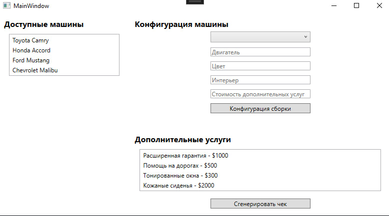
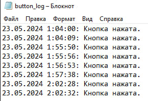

# Car Dealership Application
# Описание
Это приложение для автосалона, позволяющее управлять автомобилями, их конфигурациями и предоставлять возможность оформления покупок. Приложение разработано с использованием WPF для интерфейса пользователя и содержит модуль для логирования действий в системе, также методов, отвечающих за выполнение различных команд.
# Используемые технологии
1. C#
2. WPF
3. XAML
4. SQLite
5. Модульная архитектура (DLL)
# Функциональность



Основные функции:
* Просмотр списка автомобилей в наличии и не в наличии.
* Сборка комплектации автомобиля с использованием паттерна "строитель".
* Подсчёт цены автомобиля с учётом скидки.
* Подсчёт скидки от первоначальной цены и итоговой.
* Формирование чека покупки с указанием наименования автосалона, наименования автомобиля и его комплектации, дополнительных услуг и их стоимости, а также общей цены.
# Использование
Приложение состоит из одного основного окна:
1. Главное окно: отображает список автомобилей в наличии и не в наличии.
2. Конфигурация: позволяет настраивать комплектацию автомобиля, просматривать цену без скидки и с учётом скидки, а также добавлять дополнительные услуги.

# Пример использования
1. Выберите автомобиль, например, "Toyota Camry"

2. Настройка комплектации:
* Тип кузова: Седан
* Двигатель: V6
* Цвет: Красный
* Интерьер: Кожаный салон
* Стоимость дополнительных услуг: 1000

3. Сборка конфигурации:
* Нажмите кнопку "Конфигурация сборки"

4. Проверка итоговой цены
* Проверьте значения

5. Сформируйте чек покупки:
* Нажмите кнопку сгенерировать чек

# Внешние модули

Проект использует два внешних модуля для реализации различных методов и логирования. Эти модули находятся в папке Modules

# Модули
CarLibrary

Этот модуль содержит различные методы, используемые в программе для управления автомобилями и их конфигурациями.

ButtonLogger

Модуль логирования записывает действия в системе в лог-файлы. Логи записываются с указанием времени.

Пример кода для логирования
```
using ButtonLogger;

// Запись информационного сообщения
_loggerbutton.LogButtonClick();
```



# Пример использования базы данных
SQL-запрос
```
CREATE TABLE Cars (
    Id INTEGER PRIMARY KEY,
    Brand TEXT NOT NULL,
    Model TEXT NOT NULL,
    Price DECIMAL NOT NULL,
    HasDiscount BOOLEAN NOT NULL,
    Discount DECIMAL NOT NULL,
    ManufactureDate TEXT NOT NULL
);
```

C#-код
```
using System.Data.SQLite;

private const string ConnectionString = "Data Source=cars.db;Version=3;";

private void LoadCarsFromDatabase()
{
    _cars = new List<Car>();

    using (var connection = new SQLiteConnection(ConnectionString))
    {
        connection.Open();
        string query = "SELECT * FROM Cars";
        using (var command = new SQLiteCommand(query, connection))
        using (var reader = command.ExecuteReader())
        {
            while (reader.Read())
            {
                var car = new Car
                {
                    Id = Convert.ToInt32(reader["Id"]),
                    Brand = reader["Brand"].ToString(),
                    Model = reader["Model"].ToString(),
                    Price = Convert.ToDecimal(reader["Price"]),
                    HasDiscount = Convert.ToBoolean(reader["HasDiscount"]),
                    Discount = Convert.ToDecimal(reader["Discount"]),
                    ManufactureDate = DateTime.Parse(reader["ManufactureDate"].ToString())
                };
                _cars.Add(car);
            }
        }
    }

    CarsListBox.ItemsSource = _cars;
}
```
